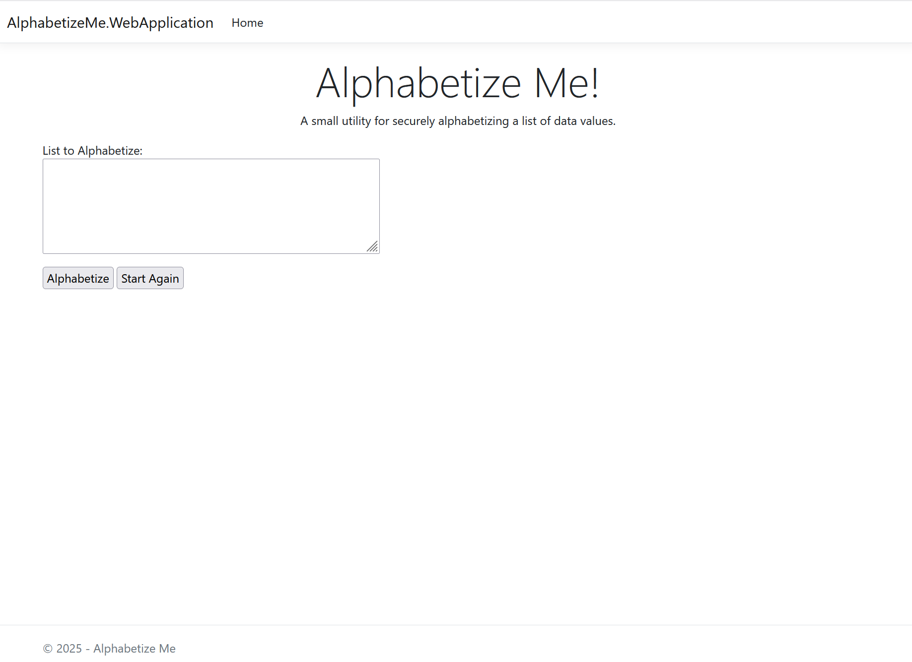

# Alphabetize Me
A small utility for securely alphabetizing a list of data values.

## Features
- Securely alphabetize any list of data.
- Will alphabetize in either order.
- Copy and paste (with permission) from the clipboard.
- Easily import your list of values.
- Export your new alphabetical list.

## How It Works
- Requests the user to enter or import their data.
- Verifies the input list provided by the user.
- Securly alphabetizes the data list in either order.
- Export the list or copies it to the clipboard.

## Source Code
View the project [Source Code](https://github.com/hayes0278/Alphabetize-Me).

## Limitations
- Does not contain any needed security code for a production deployment.
- Does not handle all list types, for example tab seperated values.

## Screenshots 

